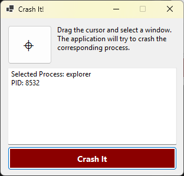
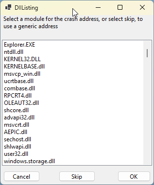

# Test Tool for dump creation

This tool attaches to any process, and makes it crash.
The process is crashed, by forcing it, to execute a bogus address.

This is useful, to test if dump files for your process are correctly created.

Select a process, click "Crash It".

You are presented a list of candidate dlls.

|Button|Crash Type|
|-|-|
|__Skip__| Process will crash at address `0x0123`|
|__OK__| Process will crash at address `SelectedModule.dll + 0x0123`  |

